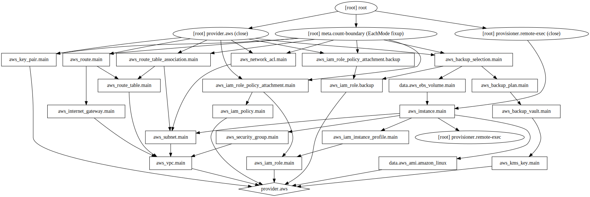

# thecraftmine
🧱 + ⛏️ = thecraftmine.com

Currently this project is being used to spin up and manage a minecraft server hosted on aws.
Thanks to [msm](https://github.com/msmhq/msm), there is a broad range of configuration including automated backups.
Default values are currently set to generate a [paper](https://papermc.io/) 1.15.2 server.

## Getting Started
Utilize the vscode remote development plugin bundle to open the dev container.

## Terraform
Below is a resource graph generated by Terraform. It can be generated by running the below command.
```
# Used to initialize the terraform project
terraform init terraform

# Create the resource stack in aws
terraform apply terraform

# Generate a visual graph of resources and their dependencies
terraform graph | dot -Tsvg > terraform/graph.svg
```


## Notes
```
# Optionally store world in RAM for a performance boost
msm thecraftmine worlds ram thecraftmine
```
